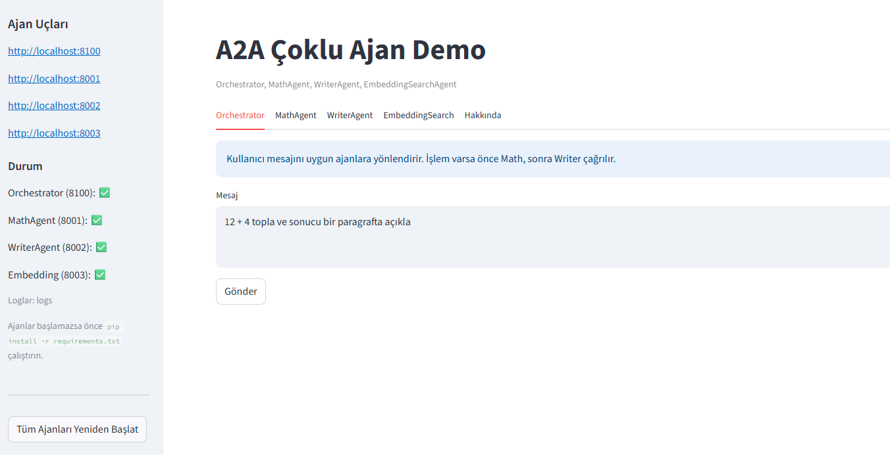
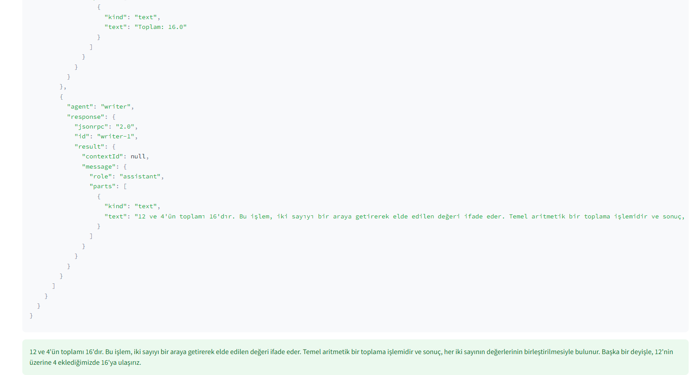
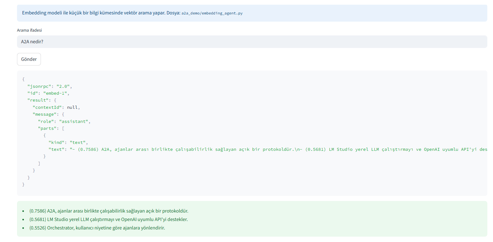

# A2A Demo (LM Studio entegrasyonlu çoklu ajan)

Bu demo, iki basit ajan (MathAgent, WriterAgent) ve bir Orchestrator ile A2A benzeri uçlar sağlar. LLM yanıtları için LM Studio'nun OpenAI uyumlu yerel sunucusu kullanılır.

## 📸 Ekran Görüntüleri

<p align="center">
  
  <br/>
  <em>Ekran 1</em>
  <br/><br/>
  
  <br/>
  <em>Ekran 2</em>
  <br/><br/>
  
  <br/>
  <em>Ekran 3</em>
  <br/><br/>
  
  <br/>
  <em>Ekran 4</em>
  <br/>

</p>

## Kurulum

1) Bağımlılıklar

```bash
pip install -r requirements.txt
```

2) LM Studio
- LM Studio'da bir model başlatın ve "OpenAI compatible server" özelliğini  `http://localhost:1234/v1` gibi bir adreste çalıştırın.

## Çalıştırma

Üç terminalde:

```bash
python a2a_demo/math_agent.py
```

```bash
python a2a_demo/writer_agent.py
```

```bash
python a2a_demo/orchestrator.py
```

Ardından orchestrator'a istek atabilirsiniz:

```bash
curl -s http://localhost:8100/.well-known/agent-card.json | jq

curl -s -X POST http://localhost:8100/ -H "Content-Type: application/json" -d '{
  "jsonrpc":"2.0",
  "id":"1",
  "method":"agent.sendMessage",
  "params":{
    "message":{"role":"user","parts":[{"kind":"text","text":"10 USD kaç TRY eder ve kısa bir paragraf yaz."}],"messageId":"m1"}
  }
}' | jq
```

Not: Bu demo güvenlik/kimlik doğrulama içermemektedir.


