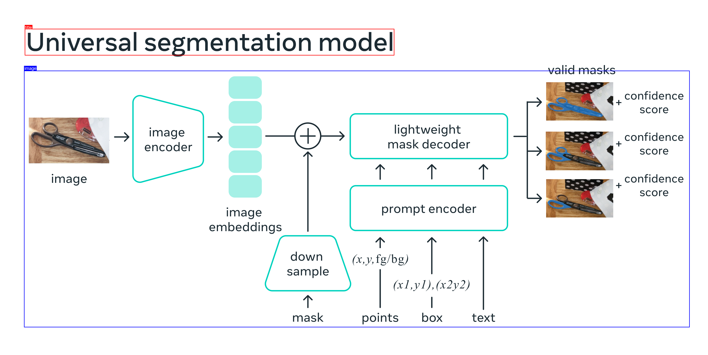

# DeepSeek-OCR Project

This project uses the DeepSeek-OCR model to extract text from images and PDF files, perform layout analysis, and process visual content.

## 📋 Table of Contents

- [Features](#features)
- [Requirements](#requirements)
- [Installation](#installation)
- [Usage](#usage)
- [Example Outputs](#example-outputs)
- [File Structure](#file-structure)

## ✨ Features

- **Single Image Processing**: OCR operations on a single image
- **PDF Processing**: Split PDF files into pages and process each page
- **5 Different Processing Modes**:
  1. **Layout Analysis**: Analyzes the layout structure of the image and shows coordinates
  2. **Free OCR**: Free OCR operation
  3. **Parse Figure**: Parses shapes and figures
  4. **Extract Text**: Extracts text from the image
  5. **Markdown Conversion**: Converts document to markdown format
- **Visualization**: Coordinate-based visualization for layout analysis and markdown conversion

## 🔧 Requirements

- Python 3.7+
- Ollama (DeepSeek-OCR model must be installed)
- PyMuPDF (fitz) - For PDF processing
- Pillow (PIL) - For visualization
- ollama Python package

## 📦 Installation

1. Install required Python packages:

```bash
pip install ollama pymupdf Pillow
```

2. Install DeepSeek-OCR model in Ollama:

```bash
ollama pull deepseek-ocr:latest
```

## 🚀 Usage

### Single Image Processing

Use `deepseek-ocr-ollama.py` script to process a single image:

```bash
python deepseek-ocr-ollama.py [image_path]
```

Or enter the image path after running the script.

**Example:**
```bash
python deepseek-ocr-ollama.py arch.png
```

### PDF Processing

Use `deepseek-ocr-pdf.py` script to process PDF files:

```bash
python deepseek-ocr-pdf.py [pdf_path]
```

Or enter the PDF path after running the script.

**Example:**
```bash
python deepseek-ocr-pdf.py 2510.04618v1.pdf
```

### Operation Selection

Both scripts provide an interactive menu when run:

```
--- DeepSeek-OCR Menu ---
Image: arch.png
1. Layout Analysis
2. Free OCR
3. Parse Figure
4. Extract Text
5. Markdown Conversion
q. Quit

Select a prompt (1-5) or 'q' to quit:
```

## 📊 Example Outputs

### Example Input Image


### Layout Analysis Output

```
<|ref|>title<|/ref|><|det|>[[35, 81, 557, 156]]<|/det|>  

<|ref|>image<|/ref|><|det|>[[34, 199, 974, 922]]<|/det|>
```

### Layout Analysis Visualization



### Extract Text Output

```
Universal segmentation model

valid masks

confidence

score

image

lightweight

confidence

encoder

mask decoder

score

image

confidence

score

image

prompt encoder

embeddings

down

(x,y,fg/bg)

sample

(x1,y1),(x2y2)

mask

points

box

text
```

## 📁 File Structure

```
OCR/
├── deepseek-ocr-ollama.py
├── deepseek-ocr-pdf.py
├── output_extract_text.txt
├── output_layout_analysis.txt
├── visualized_layout_analysis.png
├── arch.png
└── 2510.04618v1.pdf
```

## 🔍 Grounding Format

```
<|ref|>label<|/ref|><|det|>[[x1, y1, x2, y2]]<|/det|>
```

Coordinates are normalized between 0-1000.
