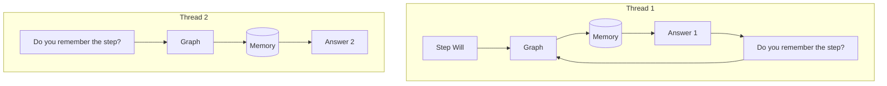
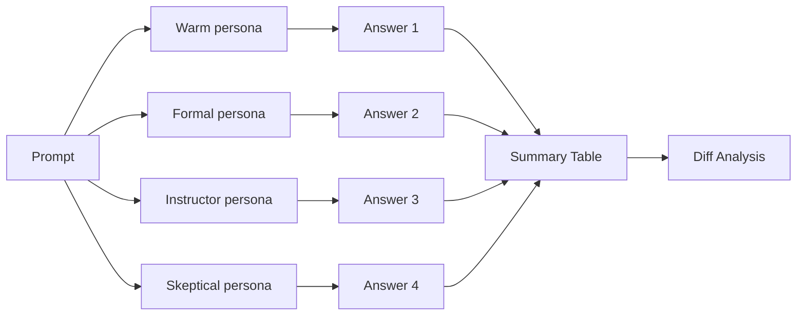
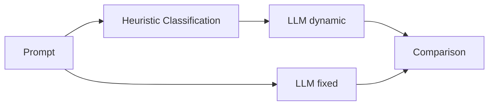

# 🤖 AI Agents & LangGraph Projects

This repository showcases multiple agent systems and LangGraph workflow examples built with modern AI tooling. The documentation and code comments have been converted to English to reflect the latest state of the project.

## 📸 Screenshots

### 🎥 YouTube QA Agent
<p align="center">
  
  <br/>
  <em>System Diagram</em>
  <br/><br/>
  
  <br/>
  <em>Home & Configuration</em>
  <br/><br/>
  
  <br/>
  <em>URL Input & Processing</em>
  <br/><br/>
  
  <br/>
  <em>Q&A Interface and Results</em>
  <br/>
</p>

### 🤝 A2A-Agent (Multi-Agent Demo)
<p align="center">
  <br/>
  <em>Screen 1</em><br/><br/>
  <br/>
  <em>Screen 2</em><br/><br/>
  <br/>
  <em>Screen 3</em><br/><br/>
  <br/>
  <em>Screen 4</em><br/>
</p>

## 🎥 Main Project: YouTube Video QA Agent

The most advanced and up-to-date project: extracts transcripts from YouTube videos and enables smart question-answering with a modern UI.

### ✨ Highlights
- 🎬 YouTube Processing: automatic transcript extraction
- 🧠 Multi-LLM Support: LM Studio (local) + Google Gemini 2.5
- 💡 Key Ideas Extraction: 3–5 core takeaways
- 🌐 Modern Streamlit UI: web interface with embedded player
- 🔍 Vector Search: FAISS-based fast retrieval
- 🌎 Full English documentation (UI supports multiple languages roadmap)

### 🚀 Quickstart
```bash
cd "Youtube Video - RAG - Agent"
streamlit run streamlit_app.py
```

📖 [Detailed Guide →](Youtube%20Video%20-%20RAG%20-%20Agent/README_youtube_qa.md)

## 🤝 A2A-Agent (Multi-Agent Demo)

Provides a simple multi-agent flow (MathAgent, WriterAgent) with an `orchestrator`, powered by LM Studio's OpenAI-compatible server.

### 🚀 Quickstart (A2A-Agent)
```bash
cd A2A-Agent

# Run in separate terminals
python math_agent.py
python writer_agent.py
python orchestrator.py
```

📖 [A2A-Agent Docs →](A2A-Agent/README.md)

---

## 🔧 LangGraph Examples

Examples built with the LangGraph library.

## Diagrams

### 1. Basic Flow (`langraph_basic.py`)

```mermaid
flowchart LR
    U[Message] --> LLM[llm_node]
    LLM --> C{is "done" included?}
    C -->|No| LLM
    C -->|Yes / MAX_TURN| E[End]
```

### 2. Thread / Memory (`langraph_stream_memory.py`)



### 3. Persona Branching (`langraph_branch_personas.py`)



### 4. Dynamic Temperature (`langraph_dynamic_temperature.py`)



## 📁 Project Structure

```
Agents-Notebooks/
├── 🎥 Youtube Video - RAG - Agent/      # Main project (Streamlit UI)
│   ├── streamlit_app.py                 # Web interface
│   ├── youtube_qa_agent.py              # Core agent logic
│   └── README_youtube_qa.md             # Detailed documentation
├── 🔧 Langraph/                         # LangGraph examples
│   ├── langraph_basic.py               # Basic flow
│   ├── langraph_stream_memory.py       # Threaded memory
│   ├── langraph_branch_personas.py     # Persona branching
│   └── langraph_dynamic_temperature.py  # Dynamic temperature
├── A2A-Agent/                           # Multi-agent demo (LM Studio)
│   ├── orchestrator.py                  # Simple orchestrator
│   ├── math_agent.py                    # Math agent
│   ├── writer_agent.py                  # Writing agent (LM Studio)
│   ├── embedding_agent.py               # Embedding helpers
│   ├── ui_streamlit.py                  # Optional UI
│   ├── common.py                        # Shared helpers (LM Studio, JSON-RPC)
│   ├── README.md
│   └── logs/                            # Logs
└── requirements.txt                     # Shared dependencies
```

## 📋 About the LangGraph scripts

1. `langraph_basic.py` – Basic loop: user message → LLM → repeat (stops if response contains "done")
2. `langraph_stream_memory.py` – Thread-based memory with `InMemorySaver` (`thread_id` isolates conversation history)
3. `langraph_branch_personas.py` – Run the same prompt across different personas, then compare results (diff modes)
4. `langraph_dynamic_temperature.py` – Classify prompt type and select temperature automatically; optional comparison vs fixed temp

## 🚀 Quickstart

### 🎥 YouTube QA Agent (Main Project)

```bash
# Go to the main project
cd "Youtube Video - RAG - Agent"

# Start the Streamlit app
streamlit run streamlit_app.py
```

Open `http://localhost:8501` in your browser.

### 🔧 LangGraph Examples (Windows cmd.exe)

#### Environment
Activate your virtual environment (e.g., `.venv`) and set env variables:

```cmd
set LG_BASE_URL=http://127.0.0.1:1234/v1
set LG_API_KEY=lm-studio
set LG_MODEL=google/gemma-3n-e4b
```

#### Install dependencies
```cmd
pip install -r requirements.txt
```

#### Run the basic example
```cmd
cd Langraph
python langraph_basic.py
```

### General Features

- Configurable via env vars (model, base URL, API key)
- Retry for transient failures
- Proper role mapping (user / assistant / system / tool)
- Maximum turn limit (prevents infinite loops)
-,Logging for observability

## Thread / Memory Example

Script: `langraph_stream_memory.py`

Goal: Isolate multiple sessions (threads) in the same app. For example, `thread_id=1` remembers the user name, `thread_id=2` starts fresh.

Run:
```cmd
python langraph_stream_memory.py
```

## Persona Branching (Comparative) Example

Script: `langraph_branch_personas.py`

What it does: Sends the same prompt to defined personas in parallel and shows:
- A summary table
- Differences in the selected diff mode

### Diff Modes (`--diff-mode`)

- `unified`: Classic line-based
- `side`: Side-by-side
- `words`: Word-level
- `all`: All of the above

### Other Flags

- `--no-diff`: Skip diffs (only summary)
- `--strict-turkish`: Warn if non-English leaks into output
- `--max-preview-chars N`: Summary clipping length

### Example

```cmd
python langraph_branch_personas.py --prompt "Write a short motivational sentence" --diff-mode side --strict-turkish
```

Personas: `warm`, `formal`, `instructor`, `skeptical`

## Dynamic Temperature Example

Script: `langraph_dynamic_temperature.py`

Logic: Classify the prompt (translation / creative / reasoning / code / factual / general) and select a temperature automatically. Optionally compare with a fixed temperature.

### Example

```cmd
python langraph_dynamic_temperature.py --prompt "Write a short motivational sentence" --show-rationale --compare
```

### Flags

- `--show-rationale`: Print classification rationale
- `--compare`: Compare dynamic vs fixed
- `--fixed-temperature 0.7`: Fixed value for comparison

## Not using a local model?

Point `LG_BASE_URL` to any OpenAI-compatible endpoint (e.g., LM Studio or a cloud service), and set `LG_API_KEY` accordingly.

## 🌟 Roadmap

### 🎥 YouTube QA Agent
- [x] Streamlit UI
- [x] Key Ideas extraction
- [x] Multi-LLM support
- [ ] A2A protocol integration
- [ ] Video timeline navigation
- [ ] Export features (PDF/Word)
- [ ] Multi-language support

### 🔧 LangGraph Examples
- [ ] Persistent memory (SQLite / file)
- [ ] Vector memory & summarization
- [ ] JSON/CSV logging
- [ ] FastAPI interface
- [ ] Load personas from external YAML

## 🤝 Contributing

### How to contribute
1. Fork and create a feature branch
2. Commit your changes
3. Open a Pull Request
4. Open issues for feature ideas

### Areas
- Bug fixes
- New features
- Documentation
- UI/UX
- Testing

### Dev environment
- Python 3.8+
- Use a virtual environment
- Code formatting: Black, isort

---

## Notes

- Windows cmd.exe: `set VARIABLE="value"`
- PowerShell: `$env:VARIABLE="value"`  
- Linux/Mac: `export VARIABLE="value"`

## 🏷️ Tech Stack

- Backend: Python, LangGraph, LangChain
- LLM: LM Studio, Google Gemini
- Frontend: Streamlit, HTML/CSS
- Vector DB: FAISS
- Video: YouTube Transcript API, PyTube