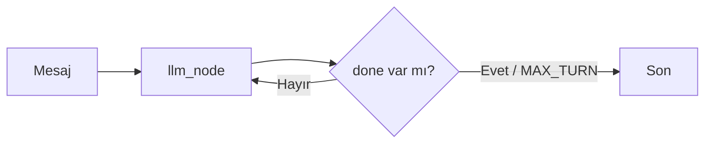
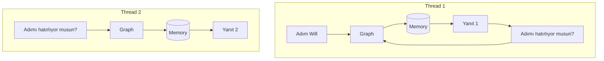
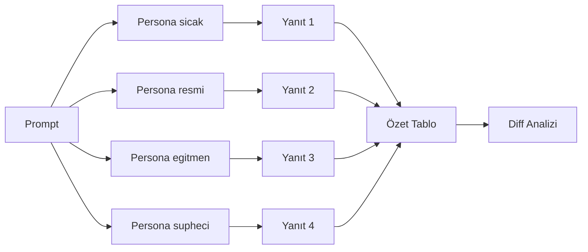

# 🤖 AI Agents & LangGraph Projeleri (Türkçe)

Bu repository, modern AI teknolojileri ile geliştirilmiş çeşitli agent sistemleri ve LangGraph workflow örneklerini Türkçe olarak sunar.

## 📸 Ekran Görüntüleri

### 🎥 YouTube QA Agent
<p align="center">
  
  <br/>
  <em>Sistem Diyagramı</em>
  <br/><br/>
  
  <br/>
  <em>Ana Sayfa ve Yapılandırma</em>
  <br/><br/>
  
  <br/>
  <em>YouTube URL Girişi ve İşleme</em>
  <br/><br/>
  
  <br/>
  <em>Soru-Cevap Arayüzü ve Sonuçlar</em>
  <br/>
</p>

### 🤝 A2A-Agent (Çoklu Ajan Demo)
<p align="center">
  <br/>
  <em>Ekran 1</em><br/><br/>
  <br/>
  <em>Ekran 2</em><br/><br/>
  <br/>
  <em>Ekran 3</em><br/><br/>
  <br/>
  <em>Ekran 4</em><br/>
</p>

## 🎥 **Ana Proje: YouTube Video QA Agent**

**En gelişmiş ve güncel proje** - YouTube videolarından transcript çıkarıp akıllı soru-cevap yapabilen modern agent sistemi.

### ✨ **Öne Çıkan Özellikler**
- 🎬 **YouTube Video İşleme**: Otomatik transcript çıkarma
- 🧠 **Multi-LLM Support**: LM Studio (yerel) + Google Gemini 2.5
- 💡 **Ana Fikirler Çıkarımı**: Video'nun 3-5 temel mesajı
- 🌐 **Modern Streamlit UI**: Web arayüzü + embedded video player
- 🔍 **Vector Search**: FAISS ile hızlı içerik arama
- 🇹🇷 **Tam Türkçe Destek**: Arayüz ve çıktılar

### 🚀 **Hızlı Başlangıç**
```bash
cd "Youtube Video - RAG - Agent"
streamlit run streamlit_app.py
```

📖 **[Detaylı Dokümantasyon →](Youtube%20Video%20-%20RAG%20-%20Agent/README_youtube_qa.md)**

## 🤝 A2A-Agent (Çoklu Ajan Demo)

LM Studio'nun OpenAI uyumlu sunucusunu kullanarak basit bir çoklu ajan (MathAgent, WriterAgent) ve `orchestrator` ile A2A benzeri bir akış sunar.

### 🚀 Hızlı Başlangıç (A2A-Agent)
```bash
cd A2A-Agent

# Ayrı terminallerde çalıştırın
python math_agent.py
python writer_agent.py
python orchestrator.py
```

📖 **[A2A-Agent Dokümantasyonu →](A2A-Agent/README.md)**

---

## 🔧 **LangGraph Örnekleri**

LangGraph kütüphanesi kullanarak çeşitli AI workflow örnekleri:

## Diyagramlar

### 1. Temel Akış (`langraph_basic.py`)



### 2. Thread / Hafıza (`langraph_stream_memory.py`)



### 3. Persona Branching (`langraph_branch_personas.py`)



### 4. Dinamik Sıcaklık (`langraph_dynamic_temperature.py`)


## 📁 **Proje Yapısı**

```
Agents-Denemeler/
├── 🎥 Youtube Video - RAG - Agent/      # Ana proje (Streamlit UI)
│   ├── streamlit_app.py                 # Web arayüzü
│   ├── youtube_qa_agent.py              # Core agent logic
│   └── README_youtube_qa.md             # Detaylı dokümantasyon
├── 🔧 Langraph/                         # LangGraph örnekleri
│   ├── langraph_basic.py               # Temel akış
│   ├── langraph_stream_memory.py       # Thread tabanlı hafıza
│   ├── langraph_branch_personas.py     # Persona branching
│   └── langraph_dynamic_temperature.py  # Dinamik sıcaklık
├── A2A-Agent/                           # A2A benzeri çoklu ajan demo (LM Studio destekli)
│   ├── orchestrator.py                  # Basit orkestratör
│   ├── math_agent.py                    # Basit matematik ajanı
│   ├── writer_agent.py                  # Yazım ajanı (LM Studio)
│   ├── embedding_agent.py               # Embedding yardımcıları
│   ├── ui_streamlit.py                  # Opsiyonel UI
│   ├── common.py                        # Ortak yardımcılar (LM Studio, JSON-RPC)
│   ├── README.md
│   └── logs/                            # Log dosyaları
└── requirements.txt                     # Ortak bağımlılıklar
```

## 📋 **LangGraph Betikleri Hakkında**

1. **`langraph_basic.py`** – Temel akış: kullanıcı mesajı → LLM → döngü ("done" geçerse durur)
2. **`langraph_stream_memory.py`** – `InMemorySaver` ile thread tabanlı hafıza (farklı `thread_id` = ayrı geçmiş)
3. **`langraph_branch_personas.py`** – Aynı prompt'u farklı persona'larla paralel çalıştırıp sonuçları renkli diff / yan yana / kelime farkı ile karşılaştırma
4. **`langraph_dynamic_temperature.py`** – Prompt türünü sınıflandırıp sıcaklığı (temperature) otomatik seçer; isteğe bağlı sabit sıcaklık karşılaştırması

## 🚀 **Hızlı Başlangıç**

### 🎥 **YouTube QA Agent (Ana Proje)**

```bash
# Ana projeye git
cd "Youtube Video - RAG - Agent"

# Streamlit uygulamasını başlat
streamlit run streamlit_app.py
```

Tarayıcıda `http://localhost:8501` açılır.

### 🔧 **LangGraph Örnekleri (Windows cmd.exe)**

#### Ortam Kurulumu
Sanal ortamını (örn. `.venv`) aktifleştir ve gerekli ortam değişkenlerini ayarla:

```cmd
set LG_BASE_URL=http://127.0.0.1:1234/v1
set LG_API_KEY=lm-studio
set LG_MODEL=google/gemma-3n-e4b
```

#### Paket Kurulumu
```cmd
pip install -r requirements.txt
```

#### Temel Örneği Çalıştırma
```cmd
cd Langraph
python langraph_basic.py
```

### Genel Özellikler

- Ortam değişkeni ile yapılandırma (model, base URL, API key)
- Geçici bağlantı hatalarına yeniden deneme (retry)
- Mesaj rolleri doğru eşleme (user / assistant / system / tool)
- Maksimum tur sınırı (sonsuz döngü engeli)
- Günlük (logging) ile izlenebilirlik

## Thread / Hafıza Örneği

**Betik:** `langraph_stream_memory.py`

**Amaç:** Aynı uygulamada farklı oturumları (thread) izole etmek. `thread_id=1` kullanıcının ismini hatırlar, `thread_id=2` temiz başlar.

**Çalıştır:**
```cmd
python langraph_stream_memory.py
```

## Persona Branching (Karşılaştırmalı) Örneği

**Betik:** `langraph_branch_personas.py`

**Ne yapar:** Tek bir prompt'u tanımlı persona'lara paralel yollayıp çıktıların:
- Bir özet tablosunu
- Seçilen moda göre farklarını

gösterir.

### Diff Modları (`--diff-mode`)

- `unified` : Klasik satır bazlı (eklenen yeşil, silinen kırmızı)
- `side` : Yan yana satırlar
- `words` : Kelime düzeyinde eklenen / silinen
- `all` : Hepsi birden

### Diğer Bayraklar

- `--no-diff` : Farkları gösterme (sadece özet tablo)
- `--strict-turkish` : İngilizce sızıntısı varsa uyarı
- `--max-preview-chars N` : Özet tablo kesme uzunluğu

### Örnek Kullanım

```cmd
python langraph_branch_personas.py --prompt "Kısa bir motivasyon cümlesi yaz" --diff-mode side --strict-turkish
```

**Persona kimlikleri (Türkçe üretim):** `sicak`, `resmi`, `egitmen`, `supheci`

## Dinamik Sıcaklık (Temperature) Örneği

**Betik:** `langraph_dynamic_temperature.py`

**Mantık:** Prompt içeriğini heuristiklerle sınıflandırır:
- çeviri / yaratıcı / akıl yürütme / kod / faktüel / genel

ve buna göre bir sıcaklık seçer. İstersen sabit sıcaklıkla karşılaştırma yapar.

### Örnek Kullanım

```cmd
python langraph_dynamic_temperature.py --prompt "Kısa bir motivasyon cümlesi yaz" --show-rationale --compare
```

### Bayraklar

- `--show-rationale` : Sınıflandırma gerekçesini yazdır
- `--compare` : Dinamik vs sabit çıktı
- `--fixed-temperature 0.7` : Karşılaştırma için sabit değer

## Yerel Model Kullanmıyorsanız

`LG_BASE_URL` değerini erişilebilir bir OpenAI-uyumlu son noktaya yönlendirin (örn. bir bulut servis ya da LM Studio). `LG_API_KEY` değerini de o servisin anahtarıyla değiştirin.

## 🌟 **Önerilen Geliştirmeler**

### 🎥 **YouTube QA Agent**
- [x] ✅ **Streamlit UI** - Tamamlandı
- [x] ✅ **Ana Fikirler Çıkarımı** - Tamamlandı  
- [x] ✅ **Multi-LLM Support** - Tamamlandı
- [ ] 🔄 **A2A Protocol Entegrasyonu** - Devam ediyor
- [ ] 📊 **Video Timeline Navigation**
- [ ] 📤 **Export Features** (PDF/Word)
- [ ] 🌍 **Multi-language Support**

### 🔧 **LangGraph Örnekleri**
- [ ] 💾 Kalıcı hafıza (SQLite / dosya) ekleme
- [ ] 🔍 Vektör hafıza & özetleme
- [ ] 📝 JSON/CSV çıktı loglama
- [ ] 🚀 FastAPI arayüzü
- [ ] 📋 Persona tanımlarını harici YAML'den yükleme

## 🤝 **Katkıda Bulunma**

### 🎯 **Nasıl Katkıda Bulunurum?**
1. **Fork yapın** ve feature branch oluşturun
2. **Kod değişikliklerinizi** commit edin
3. **Pull Request** açın
4. **Issue'lar** açarak özellik önerilerinde bulunun

### 📋 **Katkı Alanları**
- 🐛 **Bug Fixes**: Hata düzeltmeleri
- ✨ **New Features**: Yeni özellikler
- 📚 **Documentation**: Dokümantasyon iyileştirmeleri
- 🎨 **UI/UX**: Arayüz geliştirmeleri
- 🧪 **Testing**: Test senaryoları

### 🔧 **Geliştirme Ortamı**
- **Python 3.8+** gerekli
- **Virtual environment** kullanımı önerilir
- **Code formatting**: Black, isort kullanın

---

## 📝 **Notlar**

- **Windows cmd.exe**: `set DEGISKEN="deger"` formatı
- **PowerShell**: `$env:DEGISKEN="deger"` formatı  
- **Linux/Mac**: `export DEGISKEN="deger"` formatı

## 🏷️ **Teknoloji Stack**

- **🐍 Backend**: Python, LangGraph, LangChain
- **🤖 LLM**: LM Studio, Google Gemini
- **🌐 Frontend**: Streamlit, HTML/CSS
- **🔍 Vector DB**: FAISS
- **📹 Video**: YouTube Transcript API, PyTube