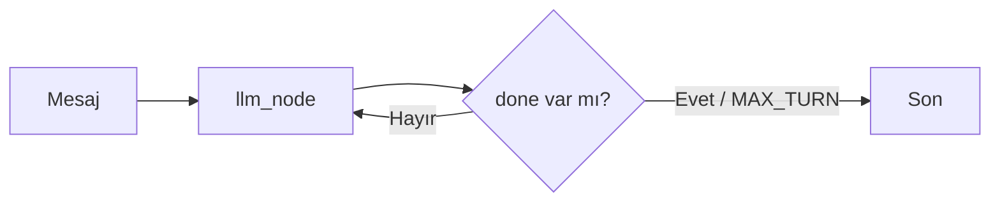
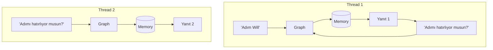
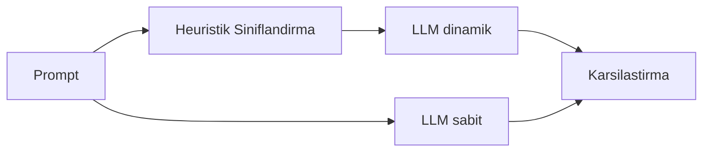

# LangGraph Örnekleri (Türkçe)


---

## Diyagramlar

### 1. Temel Akış (`langraph_basic.py`)



### 2. Thread / Hafıza (`langraph_stream_memory.py`)



### 3. Persona Branching (`langraph_branch_personas.py`)

```mermaid
flowchart LR
	P[Prompt] --> F1[Persona sicak]
	P --> F2[Persona resmi]
	P --> F3[Persona egitmen]
	P --> F4[Persona supheci]
	F1 --> R1[Yanıt 1]
	F2 --> R2[Yanıt 2]
	F3 --> R3[Yanıt 3]
	F4 --> R4[Yanıt 4]
	R1 & R2 & R3 & R4 --> COL[Ozet Tablo]
	COL --> DIFF[Diff (unified/side/words)]
```

### 4. Dinamik Sıcaklık (`langraph_dynamic_temperature.py`)



Not: Diyagramlar Mermaid desteklemeyen ortamlarda düz metin olarak görünebilir.
Betikler:

1. `langraph_basic.py` – Temel akış: kullanıcı mesajı → LLM → döngü ("done" geçerse durur).
2. `langraph_stream_memory.py` – `InMemorySaver` ile thread tabanlı hafıza (farklı `thread_id` = ayrı geçmiş).
3. `langraph_branch_personas.py` – Aynı prompt'u farklı persona'larla paralel çalıştırıp sonuçları renkli diff / yan yana / kelime farkı ile karşılaştırma.
4. `langraph_dynamic_temperature.py` – Prompt türünü sınıflandırıp sıcaklığı (temperature) otomatik seçer; isteğe bağlı sabit sıcaklık karşılaştırması.

---

## Hızlı Başlangıç (Windows cmd.exe)

Sanal ortamını (ör. `.venv`) aktifleştir ve gerekli ortam değişkenlerini ayarla (gerekirse):

```cmd
set LG_BASE_URL=http://127.0.0.1:1234/v1
set LG_API_KEY=lm-studio
set LG_MODEL=google/gemma-3n-e4b
```

Gerekli paketler:

```cmd
pip install -r requirements.txt
```

Temel örneği çalıştır:

```cmd
python langraph_basic.py
```

Özellikler (genel):

- Ortam değişkeni ile yapılandırma (model, base URL, API key).
- Geçici bağlantı hatalarına yeniden deneme (retry).
- Mesaj rolleri doğru eşleme (user / assistant / system / tool).
- Maksimum tur sınırı (sonsuz döngü engeli).
- Günlük (logging) ile izlenebilirlik.

---

## Thread / Hafıza Örneği

Betik: `langraph_stream_memory.py`

Amaç: Aynı uygulamada farklı oturumları (thread) izole etmek. `thread_id=1` kullanıcının ismini hatırlar, `thread_id=2` temiz başlar.

Çalıştır:

```cmd
python langraph_stream_memory.py
```

---

## Persona Branching (Karşılaştırmalı) Örneği

Betik: `langraph_branch_personas.py`

Ne yapar: Tek bir prompt'u tanımlı personelere paralel yollayıp çıktıların:

- Bir özet tablosunu
- Seçilen moda göre farklarını

gösterir.

Diff modları ( `--diff-mode` ):

- `unified` : Klasik satır bazlı (eklenen yeşil, silinen kırmızı)
- `side`    : Yan yana satırlar
- `words`   : Kelime düzeyinde eklenen / silinen
- `all`     : Hepsi birden

Diğer bayraklar:

- `--no-diff` : Farkları gösterme (sadece özet tablo)
- `--strict-turkish` : İngilizce sızıntısı varsa uyarı
- `--max-preview-chars N` : Özet tablo kesme uzunluğu

Örnek:
```cmd
python langraph_branch_personas.py --prompt "Kısa bir motivasyon cümlesi yaz" --diff-mode side --strict-turkish
```

Persona kimlikleri (Türkçe üretim): `sicak`, `resmi`, `egitmen`, `supheci`.

---

## Dinamik Sıcaklık (Temperature) Örneği

Betik: `langraph_dynamic_temperature.py`

Mantık: Prompt içeriğini heuristiklerle sınıflandırır:

- çeviri / yaratıcı / akıl yürütme / kod / faktüel / genel

ve buna göre bir sıcaklık seçer. İstersen sabit sıcaklıkla karşılaştırma yapar.

Örnek:

```cmd
python langraph_dynamic_temperature.py --prompt "Kısa bir motivasyon cümlesi yaz" --show-rationale --compare
```

Bayraklar:

- `--show-rationale` : Sınıflandırma gerekçesini yazdır
- `--compare` : Dinamik vs sabit çıktı
- `--fixed-temperature 0.7` : Karşılaştırma için sabit değer

---

## Yerel Modeliniz Yoksa

`LG_BASE_URL` değerini erişilebilir bir OpenAI-uyumlu son noktaya yönlendirin (ör. bir bulut servis ya da LM Studio). `LG_API_KEY` değerini de o servisin anahtarıyla değiştirin.

---

## Önerilen Geliştirmeler

- Kalıcı hafıza (SQLite / dosya) ekleme
- Vektör hafıza & özetleme
- JSON/CSV çıktı loglama
- FastAPI arayüzü
- Persona tanımlarını harici YAML'den yükleme

Katkı / sorular için: dosyaları inceleyip küçük PR'lar açabilirsiniz.

---

Tüm komutlar Windows `cmd.exe` içindir; PowerShell kullanıyorsanız `set` yerine `$env:DEGISKEN="deger"` biçimine uyarlayın.
