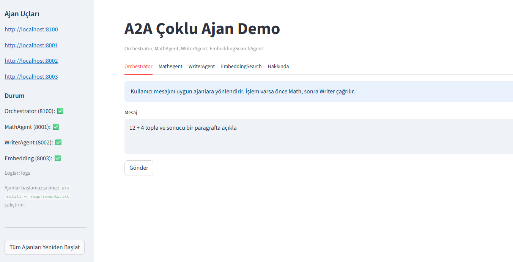

# 🤖 AI Agents & LangGraph Projects

This repository showcases multiple agent systems and LangGraph workflow examples built with modern AI tooling. All projects are fully documented in English with comprehensive examples and usage instructions.

## 📸 Screenshots

### 🎥 YouTube QA Agent
<p align="center">
  
  <br/>
  <em>System Diagram</em>
  <br/><br/>
  
  <br/>
  <em>Home & Configuration</em>
  <br/><br/>
  
  <br/>
  <em>URL Input & Processing</em>
  <br/><br/>
  
  <br/>
  <em>Q&A Interface and Results</em>
  <br/>
</p>

### 🤝 A2A-Agent (Multi-Agent Demo)
<p align="center">
  <br/>
  <em>Screen 1</em><br/><br/>
  <br/>
  <em>Screen 2</em><br/><br/>
  <br/>
  <em>Screen 3</em><br/><br/>
  <br/>
  <em>Screen 4</em><br/>
</p>

---

## 🎯 Featured Projects

### 🎥 YouTube Video QA Agent

The most advanced project: extracts transcripts from YouTube videos and enables smart question-answering with a modern UI.

**✨ Features:**
- 🎬 YouTube Processing: automatic transcript extraction
- 🧠 Multi-LLM Support: LM Studio (local) + Google Gemini 2.5
- 💡 Key Ideas Extraction: 3–5 core takeaways
- 🌐 Modern Streamlit UI: web interface with embedded player
- 🔍 Vector Search: FAISS-based fast retrieval
- 🌎 Full English documentation

**🚀 Quickstart:**
```bash
cd "Youtube Video - RAG - Agent"
streamlit run streamlit_app.py
```

📖 [Detailed Guide →](Youtube%20Video%20-%20RAG%20-%20Agent/README_youtube_qa.md)

---

### 📊 Sequential Agent - CSV Data Analysis

A comprehensive multi-agent workflow for CSV data analysis using Gemini Code Execution. Executes real Python code for statistical analysis, visualization, and anomaly detection.

**✨ Features:**
- 📂 **Data Loading Agent**: Reads and validates CSV files
- 🔍 **Analysis Agent**: Structure analysis with Google Search integration
- 💻 **Code Generation Agent**: Generates and executes Python code with Gemini Code Execution
- 🔧 **Error Correction Agent**: Automatically fixes and retries failed code
- 📈 **Visualization Agent**: Creates charts with Matplotlib/Seaborn
- 🚨 **Anomaly Detection Agent**: Identifies outliers using Z-score and IQR
- 🔎 **Insight Agent**: Extracts deep insights with Google Search
- 💡 **Recommendation Agent**: Generates actionable recommendations
- 📊 **Final Report Agent**: Creates comprehensive executive summary

**🚀 Quickstart:**
```bash
cd "Sequential Agent"
python langchain_seq.py
```

**Configuration:**
Set your Gemini API key in `langchain_seq.py`:
```python
GEMINI_API_KEY = "your_api_key_here"
```

**Workflow:**
1. Load CSV file
2. Analyze data structure
3. Generate and execute analysis code
4. Fix errors (if any)
5. Create visualizations
6. Detect anomalies
7. Extract insights
8. Generate recommendations
9. Create final report

---

### 🤝 A2A-Agent (Multi-Agent Demo)

Provides a simple multi-agent flow (MathAgent, WriterAgent) with an orchestrator, powered by LM Studio's OpenAI-compatible server.

**✨ Features:**
- Math Agent: Performs mathematical calculations
- Writer Agent: Generates text content
- Orchestrator: Coordinates agent communication
- LM Studio integration for local LLM support

**🚀 Quickstart:**
```bash
cd A2A-Agent

# Run in separate terminals
python math_agent.py
python writer_agent.py
python orchestrator.py
```

📖 [A2A-Agent Docs →](A2A-Agent/README.md)

---

## 🔧 Agent Frameworks & Tools

### 📚 LangGraph Examples

Examples built with the LangGraph library for building stateful, multi-actor applications.

#### 1. Basic Flow (`langraph_basic.py`)

Basic loop: user message → LLM → repeat (stops if response contains "done")

```mermaid
flowchart LR
    U[Message] --> LLM[llm_node]
    LLM --> C{is "done" included?}
    C -->|No| LLM
    C -->|Yes / MAX_TURN| E[End]
```

#### 2. Thread / Memory (`langraph_stream_memory.py`)

Thread-based memory with `InMemorySaver` (`thread_id` isolates conversation history)


#### 3. Persona Branching (`langraph_branch_personas.py`)

Run the same prompt across different personas, then compare results (diff modes)


#### 4. Dynamic Temperature (`langraph_dynamic_temperature.py`)

Classify prompt type and select temperature automatically; optional comparison vs fixed temp


**🚀 Quickstart:**
```bash
cd Langraph

# Set environment variables
set LG_BASE_URL=http://127.0.0.1:1234/v1
set LG_API_KEY=lm-studio
set LG_MODEL=google/gemma-3n-e4b

# Run examples
python langraph_basic.py
python langraph_stream_memory.py
python langraph_branch_personas.py --prompt "Write a short motivational sentence"
python langraph_dynamic_temperature.py --prompt "Translate to French" --compare
```

**Features:**
- Configurable via env vars (model, base URL, API key)
- Retry for transient failures
- Proper role mapping (user / assistant / system / tool)
- Maximum turn limit (prevents infinite loops)
- Logging for observability

---

### 🛠️ Tool Calling From Scratch

Educational project demonstrating tool calling with Google's Gemini AI. Shows both manual (educational) and production (recommended) approaches.

**✨ Features:**
- **Manual Approach**: Shows how tool calling works under the hood (5-step process)
- **Production Approach**: Uses native Gemini API for robust tool calling
- **Real Working Tools**:
  - `google_search` - Web search using DuckDuckGo
  - `scrape_url` - Web scraping with BeautifulSoup
  - `get_current_weather` - Weather data from Open-Meteo API
  - `calculate_math` - Safe mathematical expression evaluation
  - `get_current_time` - Real time for any timezone
  - `wikipedia_search` - Wikipedia article summaries
  - `get_exchange_rate` - Real-time currency exchange rates

**🚀 Quickstart:**
```bash
cd "Tool Calling From Scratch"

# Set API key
set GEMINI_API_KEY=your_api_key_here

# Run application
python app.py
```

**Menu Options:**
- **1** - Manual Tool Calling Demo (Educational)
- **2** - Production Tool Calling Demo (Recommended)
- **3** - Interactive Mode (Chat with the AI)
- **4** - Run All Demos

📖 [Detailed Docs →](Tool%20Calling%20From%20Scratch/README.md)

---

### ⚡ Groq - Mixture of Agents

Advanced agent system using Groq API with rate limit management, ReAct agent pattern, and web search capabilities.

**✨ Features:**
- Groq API integration with free tier optimization
- Rate limit management (TPM/RPM tracking)
- ReAct agent pattern (Reasoning + Acting)
- DuckDuckGo web search integration
- Rich console output for better readability
- Conversation memory management

**🚀 Quickstart:**
```bash
cd "Groq - Mixture of Agents"

# Set API key
set GROQ_API_KEY=your_api_key_here

# Run agent
python advanced_agents.py
```

**Files:**
- `advanced_agents.py` - Main agent implementation
- `duckduckgo_agent.py` - Web search agent
- `app.ipynb` - Jupyter notebook examples

---

## 🗄️ Database & Storage Agents

### 🍃 MongoDB SQL Talk

Intelligent agent that lets you interact with MongoDB databases in natural language. Supports dynamic collection detection and automatic schema analysis.

**✨ Features:**
- Natural Language Understanding: "find users whose name is Ahmet"
- Dynamic Collection Detection: Works with any collection name
- Smart Data Insertion: "add a new user"
- Automatic Schema Analysis: Detects existing fields
- Web Interface: User-friendly modern web UI
- LM Studio Integration: Local LLM support

**🚀 Quickstart:**
```bash
cd "Mongodb SQL Talk"

# Start MongoDB and LM Studio first
python mongodb-langchain-agent-clean.py
```

Open `http://localhost:5000` in your browser.

**Example Queries:**
- "list collections"
- "show the first 5 records in the users table"
- "find users whose name is Ahmet"
- "add a user: name Mehmet, surname Kaya, age 30"
- "how many users are there?"

📖 [Detailed Docs →](Mongodb%20SQL%20Talk/README.md)

---

## 🖥️ Local LLM Integration

### 🦙 Ollama

Web search integration with Ollama local LLM for enhanced agent capabilities.

**✨ Features:**
- Ollama local LLM integration
- Web search capabilities
- Simple agent implementation

**🚀 Quickstart:**
```bash
cd Ollama

# Start Ollama first
ollama serve

# Run agent
python web_search.py
```

---

### 📦 Agno

Collection of advanced agent projects including RAG agents, SQLite storage, structured output, and Ollama integration.

**✨ Features:**
- RAG (Retrieval-Augmented Generation) agent
- SQLite storage integration
- Structured output generation
- Ollama local LLM support
- CSV analysis capabilities

**🚀 Quickstart:**
```bash
cd Agno

# Install dependencies
pip install -r requirements_rag.txt  # For RAG agent
pip install -r requirements_advanced.txt  # For advanced features

# Run specific agent
python ollama-rag-agent.py
python csv_analysis.py
python Structured-output.py
```

**Files:**
- `ollama-rag-agent.py` - RAG agent with Ollama
- `csv_analysis.py` - CSV data analysis
- `sqlite-storage.py` - SQLite storage integration
- `Structured-output.py` - Structured output generation
- `app.py` - Main application

---

## 🎓 Specialized Agents

### 🐍 Phidata-Agent

Python execution agent using Phidata framework for code execution and agent management.

**✨ Features:**
- Python code execution
- Phidata framework integration
- Agent orchestration

**🚀 Quickstart:**
```bash
cd Phidata-Agent
python python-execute-agent.py
```

---

### 🔬 AgentScope

Agent framework example using AgentScope for multi-agent systems.

**✨ Features:**
- AgentScope framework integration
- Multi-agent communication
- Agent orchestration

**🚀 Quickstart:**
```bash
cd AgentScope
python agentscope_example.py
```

---

### 🐝 BeeAI Framework

FastAPI-based agent framework with web interface for building agent applications.

**✨ Features:**
- FastAPI backend
- Modern web interface
- Agent management UI
- RESTful API

**🚀 Quickstart:**
```bash
cd "BeeAI Framework"

# Run FastAPI app
python fastapi_app.py

# Or run Flask app
python app.py
```

Open `http://localhost:8000` (FastAPI) or `http://localhost:5000` (Flask) in your browser.

---

### 🧩 General

General AI agent system with customizable agent configurations.

**✨ Features:**
- Configurable agent system
- Multiple agent types
- Extensible architecture

**🚀 Quickstart:**
```bash
cd General
pip install -r requirements.txt
python ai_agent_system.py
```

---

## 📁 Project Structure

```
Agents-Notebooks/
├── 🎥 Youtube Video - RAG - Agent/      # Main project (Streamlit UI)
│   ├── streamlit_app.py                 # Web interface
│   ├── youtube_qa_agent.py              # Core agent logic
│   └── README_youtube_qa.md             # Detailed documentation
│
├── 📊 Sequential Agent/                  # CSV Analysis Multi-Agent
│   ├── langchain_seq.py                 # Main workflow
│   └── monthly-car-sales.csv            # Example data
│
├── 🔧 Langraph/                         # LangGraph examples
│   ├── langraph_basic.py               # Basic flow
│   ├── langraph_stream_memory.py       # Threaded memory
│   ├── langraph_branch_personas.py     # Persona branching
│   └── langraph_dynamic_temperature.py  # Dynamic temperature
│
├── 🤝 A2A-Agent/                        # Multi-agent demo (LM Studio)
│   ├── orchestrator.py                  # Simple orchestrator
│   ├── math_agent.py                    # Math agent
│   ├── writer_agent.py                  # Writing agent
│   ├── embedding_agent.py               # Embedding helpers
│   ├── ui_streamlit.py                  # Optional UI
│   └── common.py                        # Shared helpers
│
├── 🛠️ Tool Calling From Scratch/        # Tool calling examples
│   ├── app.py                           # Main application
│   ├── simple_tool_calling.py           # Simple implementation
│   └── README.md                        # Documentation
│
├── ⚡ Groq - Mixture of Agents/         # Groq API agents
│   ├── advanced_agents.py               # Main agent
│   ├── duckduckgo_agent.py              # Web search agent
│   └── app.ipynb                        # Jupyter notebook
│
├── 🗄️ Mongodb SQL Talk/                 # MongoDB agent
│   ├── mongodb-langchain-agent-clean.py # Main application
│   ├── templates/                       # Web UI templates
│   ├── static/                          # Static files
│   └── README.md                        # Documentation
│
├── 🦙 Ollama/                           # Ollama integration
│   ├── web_search.py                    # Web search agent
│   └── web-search.py                    # Alternative implementation
│
├── 📦 Agno/                             # Advanced agents
│   ├── ollama-rag-agent.py              # RAG agent
│   ├── csv_analysis.py                  # CSV analysis
│   ├── sqlite-storage.py                # SQLite storage
│   ├── Structured-output.py             # Structured output
│   └── app.py                           # Main app
│
├── 🐍 Phidata-Agent/                    # Phidata framework
│   └── python-execute-agent.py          # Python execution agent
│
├── 🔬 AgentScope/                       # AgentScope framework
│   └── agentscope_example.py            # Example implementation
│
├── 🐝 BeeAI Framework/                  # FastAPI framework
│   ├── fastapi_app.py                   # FastAPI application
│   ├── app.py                           # Flask application
│   └── static/                          # Web interface
│
├── 🧩 General/                          # General agent system
│   ├── ai_agent_system.py               # Main system
│   └── requirements.txt                 # Dependencies
│
└── requirements.txt                     # Shared dependencies
```

---

## 🚀 Quickstart Guide

### Prerequisites

- Python 3.8+
- Virtual environment (recommended)
- API keys (as needed for each project):
  - Gemini API key (for YouTube QA, Sequential Agent, Tool Calling)
  - Groq API key (for Groq agents)
  - LM Studio (for local LLM projects)

### Installation

1. **Clone the repository:**
```bash
git clone <repository-url>
cd Agents-Notebooks
```

2. **Create virtual environment:**
```bash
python -m venv venv
venv\Scripts\activate  # Windows
# or
source venv/bin/activate  # Linux/Mac
```

3. **Install dependencies:**
```bash
pip install -r requirements.txt
```

### Environment Variables

**Windows (cmd.exe):**
```cmd
set GEMINI_API_KEY=your_api_key_here
set GROQ_API_KEY=your_api_key_here
set LG_BASE_URL=http://127.0.0.1:1234/v1
set LG_API_KEY=lm-studio
set LG_MODEL=google/gemma-3n-e4b
```

**PowerShell:**
```powershell
$env:GEMINI_API_KEY="your_api_key_here"
$env:GROQ_API_KEY="your_api_key_here"
```

**Linux/Mac:**
```bash
export GEMINI_API_KEY=your_api_key_here
export GROQ_API_KEY=your_api_key_here
```

---

## 📋 Project Details

### LangGraph Scripts

1. **`langraph_basic.py`** – Basic loop: user message → LLM → repeat (stops if response contains "done")
2. **`langraph_stream_memory.py`** – Thread-based memory with `InMemorySaver` (`thread_id` isolates conversation history)
3. **`langraph_branch_personas.py`** – Run the same prompt across different personas, then compare results (diff modes)
4. **`langraph_dynamic_temperature.py`** – Classify prompt type and select temperature automatically; optional comparison vs fixed temp

### Persona Branching Example

**Diff Modes (`--diff-mode`):**
- `unified`: Classic line-based
- `side`: Side-by-side
- `words`: Word-level
- `all`: All of the above

**Other Flags:**
- `--no-diff`: Skip diffs (only summary)
- `--strict-turkish`: Warn if non-English leaks into output
- `--max-preview-chars N`: Summary clipping length

**Example:**
```bash
python langraph_branch_personas.py --prompt "Write a short motivational sentence" --diff-mode side --strict-turkish
```

### Dynamic Temperature Example

**Flags:**
- `--show-rationale`: Print classification rationale
- `--compare`: Compare dynamic vs fixed
- `--fixed-temperature 0.7`: Fixed value for comparison

**Example:**
```bash
python langraph_dynamic_temperature.py --prompt "Write a short motivational sentence" --show-rationale --compare
```

---

## 🌟 Roadmap

### 🎥 YouTube QA Agent
- [x] Streamlit UI
- [x] Key Ideas extraction
- [x] Multi-LLM support
- [ ] A2A protocol integration
- [ ] Video timeline navigation
- [ ] Export features (PDF/Word)
- [ ] Multi-language support

### 📊 Sequential Agent
- [x] Multi-agent workflow
- [x] Code execution with Gemini
- [x] Error correction
- [x] Visualization
- [x] Anomaly detection
- [ ] Streamlit UI
- [ ] Export reports (PDF/Excel)
- [ ] Real-time analysis

### 🔧 LangGraph Examples
- [ ] Persistent memory (SQLite / file)
- [ ] Vector memory & summarization
- [ ] JSON/CSV logging
- [ ] FastAPI interface
- [ ] Load personas from external YAML

### 🛠️ Tool Calling From Scratch
- [x] Manual tool calling
- [x] Production tool calling
- [ ] More tool examples
- [ ] Tool composition examples
- [ ] Async tool calling

### ⚡ Groq - Mixture of Agents
- [x] Rate limit management
- [x] ReAct agent pattern
- [ ] Advanced agent orchestration
- [ ] Agent communication protocols
- [ ] Multi-agent collaboration

---

## 🤝 Contributing

### How to contribute
1. Fork and create a feature branch
2. Commit your changes
3. Open a Pull Request
4. Open issues for feature ideas

### Areas for contribution
- Bug fixes
- New features
- Documentation
- UI/UX improvements
- Testing
- Performance optimization

### Dev environment
- Python 3.8+
- Use a virtual environment
- Code formatting: Black, isort
- Follow PEP 8 style guide

---

## 🏷️ Tech Stack

### Backend
- **Python** 3.8+
- **LangGraph** - Stateful, multi-actor applications
- **LangChain** - LLM application framework
- **FastAPI** - Modern web framework
- **Flask** - Lightweight web framework
- **Streamlit** - Rapid web app development

### LLM Providers
- **Google Gemini** - Advanced AI models
- **Groq** - Fast inference API
- **LM Studio** - Local LLM support
- **Ollama** - Local LLM runner

### Databases & Storage
- **MongoDB** - NoSQL database
- **SQLite** - Lightweight database
- **FAISS** - Vector similarity search
- **Pandas** - Data manipulation

### Tools & Utilities
- **BeautifulSoup** - Web scraping
- **DuckDuckGo** - Web search
- **Rich** - Rich text and beautiful formatting
- **PyTube** - YouTube video processing
- **YouTube Transcript API** - Transcript extraction

---

## 📝 Notes

### Environment Variables
- **Windows cmd.exe**: `set VARIABLE="value"`
- **PowerShell**: `$env:VARIABLE="value"`
- **Linux/Mac**: `export VARIABLE="value"`

### API Keys
- Get Gemini API key from: [Google AI Studio](https://aistudio.google.com/app/apikey)
- Get Groq API key from: [Groq Console](https://console.groq.com/)
- LM Studio: Download from [lmstudio.ai](https://lmstudio.ai/)

### Local LLM Setup
1. Download and install LM Studio
2. Load a model (e.g., Gemma, Qwen)
3. Start the server on port 1234
4. Set environment variables accordingly

---

## 📄 License

See LICENSE file in the repository.

---

## 🙏 Acknowledgments

- [LangChain](https://github.com/langchain-ai/langchain) - Agent framework
- [LangGraph](https://github.com/langchain-ai/langgraph) - Stateful agent workflows
- [LM Studio](https://lmstudio.ai/) - Local LLM support
- [Google Gemini](https://ai.google.dev/) - Advanced AI models
- [Groq](https://groq.com/) - Fast inference API
- [Streamlit](https://streamlit.io/) - Web app framework
- [MongoDB](https://www.mongodb.com/) - Database
- [Ollama](https://ollama.ai/) - Local LLM runner

---

## 📧 Contact

For questions, suggestions, or contributions, please open an issue or pull request.

---

**⭐ If you find this repository helpful, please consider giving it a star!**
