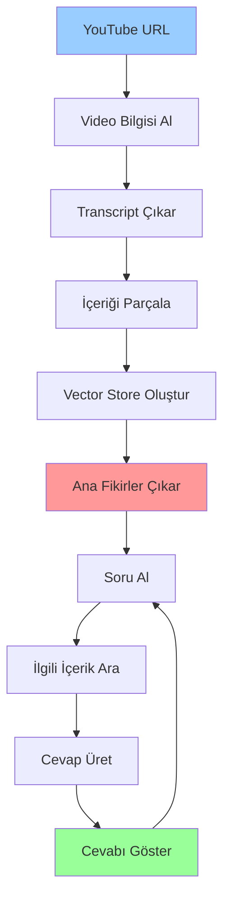
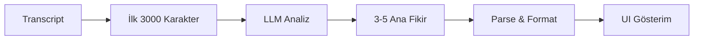

# 🎥 YouTube Video Soru-Cevap Agent Sistemi

Modern AI teknolojileri ile YouTube videolarından transcript çıkarıp, video içeriği hakkında akıllı soru-cevap yapmanızı sağlayan gelişmiş agent sistemi. LangGraph workflow'u ve çoklu LLM desteği ile güçlendirilmiştir.

## 🚀 Özellikler

### 🎯 **Core Features**
- **🎬 YouTube Video İşleme**: Otomatik transcript çıkarma (Türkçe/İngilizce)
- **🧠 Akıllı İçerik Analizi**: Video içeriğini anlamlı parçalara ayırma
- **🔍 Vector Arama**: FAISS ile hızlı ve doğru içerik arama
- **💡 Ana Fikirler Çıkarımı**: Video'nun 3-5 temel mesajını otomatik belirleme
- **💬 Akıllı Soru-Cevap**: Context-aware yanıtlar
- **🇹🇷 Türkçe Destek**: Tam Türkçe arayüz ve cevaplar
- **📝 Konuşma Geçmişi**: Önceki sorularınızı takip etme

### 🤖 **Multi-LLM Support** 
- **🏠 LM Studio**: Yerel modeller (Gemma, Llama, Mistral vb.)
- **☁️ Google Gemini**: Gemini 2.5 Flash/Pro modelleri
- **🔄 Flexible Provider**: Kolay model değiştirme

### 🎨 **Modern Web UI**
- **📱 Streamlit Web Arayüzü**: Modern ve kullanıcı dostu
- **🎥 Embedded Video Player**: Video direkt uygulamada
- **📊 Detaylı İstatistikler**: İçerik analiz metrikleri
- **🎯 Ana Fikirler Gösterimi**: Görsel kart formatında
- **📋 Transcript İnceleme**: Parça parça içerik görüntüleme

## 📋 Gereksinimler

### Kütüphaneler
```bash
pip install -r requirements.txt
```

### API Keys (Opsiyonel)
- **Google Gemini API Key**: Gemini modelleri için (sadece bulut modu)
- **LM Studio**: Yerel modeller için API key gerekmez

## 🛠️ Kurulum

### 1. **Kütüphaneleri Yükleyin**
```bash
pip install -r requirements.txt
```

### 2. **Model Sağlayıcısını Seçin**

#### 🏠 **LM Studio (Yerel - Önerilen)**
1. [LM Studio](https://lmstudio.ai/)'yu indirin ve kurun
2. Bir model indirin (örn: Gemma, Llama, Mistral)
3. Embedding modeli indirin (örn: mxbai-embed-large)
4. Server'ı başlatın (varsayılan port: 1234)

#### ☁️ **Google Gemini (Bulut)**
```bash
export GOOGLE_API_KEY="your-gemini-api-key"
```

Windows için:
```cmd
set GOOGLE_API_KEY=your-gemini-api-key
```

## 💻 Kullanım

### 🌐 **Web Arayüzü (Önerilen)**
```bash
# Ana dizinde
cd "Youtube Video - RAG - Agent"

# Streamlit uygulamasını başlat
streamlit run streamlit_app.py
```

Tarayıcınızda `http://localhost:8501` adresine gidin ve:
1. **Model seçin**: LM Studio veya Gemini
2. **API bilgilerini girin**: (Gemini için API key)
3. **Agent'i yapılandırın**: Ayarları kaydet
4. **YouTube URL'si girin**: Video linkini yapıştır
5. **Soru sorun**: Ana fikirler otomatik çıkarılır

### 🖥️ **Komut Satırı Kullanımı**
```bash
python youtube_qa_agent.py
```

### 📝 **Programatik Kullanım**

#### LM Studio ile:
```python
from youtube_qa_agent import YouTubeQAAgent

# LM Studio agent
agent = YouTubeQAAgent(
    provider="lm_studio",
    lm_studio_url="http://localhost:1234/v1",
    model_name="gemma-3n-e4b",
    embedding_model="text-embedding-mxbai-embed-large-v1"
)

# Video işle
state = agent.process_video("https://www.youtube.com/watch?v=VIDEO_ID")

# Ana fikirler otomatik çıkarılır
print("Ana Fikirler:")
for i, insight in enumerate(state["key_insights"], 1):
    print(f"{i}. {insight}")

# Soru sor
state = agent.ask_question(state, "Bu video ne hakkında?")
print(f"Cevap: {state['answer']}")
```

#### Gemini ile:
```python
agent = YouTubeQAAgent(
    provider="gemini",
    api_key="your-gemini-api-key",
    model_name="gemini-2.5-flash"
)
```

## 🔄 Sistem Akışı



### 🎯 **Ana Fikirler Workflow'u**


## 📖 Detaylı Örnek

```python
import os
from youtube_qa_agent import YouTubeQAAgent

# LM Studio ile örnek
agent = YouTubeQAAgent(
    provider="lm_studio",
    model_name="gemma-3n-e4b",
    embedding_model="text-embedding-mxbai-embed-large-v1"
)

# Video işle
video_url = "https://www.youtube.com/watch?v=dQw4w9WgXcQ"
print("🔵 Video işleniyor...")
state = agent.process_video(video_url)

if not state["error_message"]:
    print(f"✅ Video işlendi: {state['video_title']}")
    print(f"📝 Transcript: {len(state['transcript'])} karakter")
    print(f"🧩 Parça sayısı: {len(state['chunks'])}")
    
    # Ana fikirler
    print(f"\n🎯 Ana Fikirler ({len(state['key_insights'])} adet):")
    for i, insight in enumerate(state['key_insights'], 1):
        print(f"   {i}. {insight}")
    
    # Sorular sor
    questions = [
        "Bu video ne hakkında?",
        "Ana mesaj nedir?",
        "Hangi konular ele alınıyor?"
    ]
    
    for question in questions:
        print(f"\n🤔 Soru: {question}")
        state = agent.ask_question(state, question)
        print(f"🤖 Cevap: {state['answer']}")
        print(f"📄 Kullanılan parça sayısı: {len(state['relevant_chunks'])}")
else:
    print(f"❌ Hata: {state['error_message']}")
```

## ⚙️ Yapılandırma

### Text Splitter Ayarları
```python
# youtube_qa_agent.py içinde
self.text_splitter = RecursiveCharacterTextSplitter(
    chunk_size=1000,      # Parça boyutu
    chunk_overlap=200,    # Parçalar arası örtüşme
    length_function=len,
)
```

### LLM Ayarları

#### LM Studio:
```python
self.llm = ChatOpenAI(
    base_url="http://localhost:1234/v1",
    model="gemma-3n-e4b",
    temperature=0.1,
    max_tokens=2000
)
```

#### Gemini:
```python
self.llm = ChatGoogleGenerativeAI(
    model="gemini-2.5-flash",
    temperature=0.1,
    max_tokens=2000
)
```

### Vector Search Ayarları
```python
# Benzerlik aramasında kaç parça döndürülecek
docs = state["vectorstore"].similarity_search(
    state["question"], 
    k=4  # En alakalı 4 parçayı al
)
```

## 🐛 Hata Giderme

### Yaygın Hatalar

1. **"Transcript çıkarılamadı"**
   - Video'da transcript bulunmuyor olabilir
   - Video gizli veya erişilemez durumda olabilir

2. **"Geçersiz YouTube URL"**
   - URL formatını kontrol edin
   - Desteklenen formatlar: youtube.com/watch?v=, youtu.be/

3. **"LM Studio bağlantı hatası"**
   - LM Studio server'ının çalıştığından emin olun
   - Port numarasını kontrol edin (varsayılan: 1234)
   - Model yüklendiğinden emin olun

4. **"Gemini API hatası"**
   - API key'inizi kontrol edin
   - Rate limit'e takılmış olabilirsiniz

### Debug Modu
```python
import logging
logging.basicConfig(level=logging.DEBUG)
```

## 🎯 Desteklenen Video Formatları

- `https://www.youtube.com/watch?v=VIDEO_ID`
- `https://youtu.be/VIDEO_ID`
- `https://youtube.com/embed/VIDEO_ID`

## 📊 Performans

### ⏱️ **İşlem Süreleri**
- **Video İşleme**: 30-90 saniye (video uzunluğuna bağlı)
- **Ana Fikirler**: 10-20 saniye ek süre
- **Soru-Cevap**: 2-5 saniye per soru

### 🔢 **Token Kullanımı**
- **LM Studio**: Sınırsız (yerel model)
- **Gemini**: ~1000-5000 token per soru
- **Ana Fikirler**: ~500-1500 token (bir kez)

### 💾 **Bellek Kullanımı**
- **Base**: ~50-100MB
- **Video İçeriği**: Video uzunluğuna bağlı (~50-200MB)
- **Vector Store**: ~10-50MB (parça sayısına bağlı)

## 🔐 Güvenlik

### 🔑 **API Key Yönetimi**
- **Gemini API Key**: Environment variable kullanın
- **LM Studio**: Yerel çalıştığı için güvenli
- Kodu public repository'lerde paylaşırken API key'leri gizleyin

### 🛡️ **Veri Güvenliği**
- **LM Studio**: Tüm veriler yerel kalır
- **Gemini**: Google'a gönderilen veriler için ToS geçerli
- YouTube transcript'leri geçici olarak işlenir

### 🔒 **En İyi Uygulamalar**
- Hassas videolar için LM Studio tercih edin
- API key'leri `.env` dosyasında saklayın
- Production'da HTTPS kullanın

## 🤝 Katkıda Bulunma

1. Fork yapın
2. Feature branch oluşturun (`git checkout -b feature/amazing-feature`)
3. Commit yapın (`git commit -m 'Add amazing feature'`)
4. Push yapın (`git push origin feature/amazing-feature`)
5. Pull Request açın

## 🆘 Destek & İletişim

### 🐛 **Sorun Bildirimi**
- GitHub Issues'da sorun bildirin
- Hata raporlarında sistem bilgilerini ekleyin
- Örnek video URL'si ve hata mesajını paylaşın

### 💡 **Özellik İstekleri**
- Yeni özellik önerilerinizi GitHub Issues'da paylaşın
- Kullanım senaryonuzu detaylandırın

### 📧 **Direkt İletişim**
- Email: [Proje sahibi email]
- GitHub Discussions kullanabilirsiniz

## 🌟 **Özellikler Roadmap**

### 🔜 **Yakında Gelecek**
- [ ] **A2A Protocol Entegrasyonu**: Multi-agent architecture
- [ ] **Video Timeline**: Zaman damgalı içerik navigasyonu
- [ ] **Batch Processing**: Çoklu video işleme
- [ ] **Export Features**: PDF/Word rapor çıktısı

### 🎯 **Gelecek Sürümler**
- [ ] **Multi-language Support**: İngilizce UI
- [ ] **Voice Interface**: Sesli soru-cevap
- [ ] **Video Summarization**: Otomatik özet üretimi
- [ ] **Collaborative Features**: Takım çalışması

## 📄 Lisans

Bu proje MIT lisansı altında lisanslanmıştır. Detaylar için `LICENSE` dosyasına bakın.

---

## 🏷️ **Teknoloji Stack**

- **🐍 Backend**: Python, LangGraph, LangChain
- **🤖 LLM**: LM Studio (Gemma/Llama), Google Gemini 2.5
- **🔍 Vector DB**: FAISS
- **🌐 Frontend**: Streamlit
- **📹 Video**: YouTube Transcript API, PyTube
- **🎨 UI**: Rich Console (CLI), Custom CSS (Web)

**Not**: Bu sistem eğitim ve araştırma amaçlıdır. Ticari kullanım için YouTube API terms of service'i ve model lisanslarını kontrol edin.
